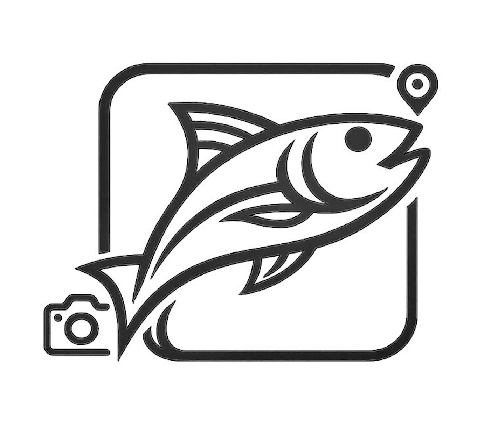

<div align="center">



# Fishdex

**The social platform for anglers.**  
Identify your catch with AI, log every session, connect with the fishing community.

[](https://flutter.dev)
[](https://firebase.google.com)
[](https://vercel.com)
[](.)
[](.)

</div>

---

## What is Fishdex?

Fishdex is a mobile-first progressive web application designed for fishing enthusiasts. It combines AI-powered species recognition, session tracking, social sharing, and a community marketplace — all in one platform accessible directly from the home screen of any iOS or Android device.

Think of it as **Strava, but for fishing.**

### Core Features

| Feature | Description |
|---|---|
| **AI Identification** | Photograph your catch and get instant species identification powered by a computer vision model |
| **Catch Logbook** | Record size, weight, location, weather conditions, and notes for every catch |
| **Social Feed** | Follow other anglers, like and comment on their catches, and discover top performers |
| **Fishing Map** | Browse and contribute community hotspots with GPS-precise or zone-based locations |
| **Seasonal Calendar** | Know which species are in season and where to find them |
| **Messaging** | Direct conversations between anglers |
| **Marketplace** | Browse fishing gear and locate nearby tackle shops |
| **Collection** | A personal gallery of every species ever caught, with confidence scores and Wikipedia references |

---

## Architecture

This repository contains the **Flutter Web front-end** and the **Firebase back-end configuration**. The AI inference service is maintained in a dedicated repository:

> **AI Repository** — Species identification model & API  
> [github.com/Boyuzhang333/FishDex](https://github.com/Boyuzhang333/FishDex)

```
┌────────────────────────────────────────────────────────┐
│                        Client                          │
│          Flutter Web PWA  (this repository)            │
│                Hosted on Vercel                        │
└───────────┬──────────────────────────┬─────────────────┘
            │                          │
            ▼                          ▼
  ┌─────────────────┐        ┌──────────────────────┐
  │  Firebase        │        │  AI Inference API    │
  │  ─ Auth          │        │  (Vision model)      │
  │  ─ Firestore     │        │  Boyuzhang333/FishDex│
  │  ─ Notifications │        └──────────────────────┘
  └─────────────────┘
```

---

## Tech Stack

### Front-end

| Layer | Technology |
|---|---|
| Framework | Flutter Web 3.x |
| Deployment | Vercel (CI/CD on every push to `main`) |
| UI & Animations | `flutter_animate`, `glassmorphism`, `google_fonts` |
| Maps | `flutter_map` + OpenStreetMap tiles |
| Location | `geolocator` |
| Networking | `http` |
| Media | `image_picker`, `cached_network_image` |

### Back-end (Firebase)

| Service | Usage |
|---|---|
| **Firebase Auth** | Email/password authentication, account management |
| **Cloud Firestore** | All application data (users, catches, messages, notifications) |

---

## Data Model

```
users/{uid}
  displayName, username, catchCount, createdAt

catches/{id}
  userId, species, frenchName, family, confidence, top5[]
  sizecm, weightkg, location, lat, lng, locationRadius
  weather, seaState, windSpeed
  notes, imageBase64, fishImageUrl
  isPublished, isPrivate, isManualEntry
  timestamp

catches/{id}/comments/{id}
  userId, userName, text, timestamp

conversations/{id}              ← id = sorted(uid_a + uid_b)
  participants[], userData{}, lastMessage, lastAt, unread{}

conversations/{id}/msgs/{id}
  senderId, text, timestamp

notifications/{uid}/items/{id}
  type (like | comment | follow | message)
  fromUserId, fromUserName, catchId, catchName
  timestamp, read

follows/{uid}/following/{targetUid}
follows/{uid}/followers/{sourceUid}
```

---

## Project Structure

```
lib/
├── main.dart                  # App shell & bottom navigation
├── theme/
│   └── fishdex_theme.dart     # Design tokens, colors, typography
├── models/
│   └── catch_model.dart       # FishCatch data class
├── services/
│   ├── auth_service.dart      # Firebase Auth wrapper
│   ├── catch_service.dart     # CRUD for catches
│   ├── follow_service.dart    # Follow / unfollow, counts
│   ├── hotspot_service.dart   # Fishing hotspot CRUD
│   ├── messaging_service.dart # Conversations & messages
│   └── social_service.dart    # Feed, likes, comments
├── screens/
│   ├── home_screen.dart       # Feed, hotspot map, quick actions
│   ├── camera_screen.dart     # Photo capture & AI identification
│   ├── catch_detail_screen.dart
│   ├── collection_screen.dart
│   ├── messages_screen.dart
│   ├── conversation_screen.dart
│   ├── marketplace_screen.dart
│   ├── profile_screen.dart
│   ├── user_profile_screen.dart
│   ├── fishing_map_screen.dart
│   └── fishing_calendar_screen.dart
└── widgets/
    ├── liquid_nav_bar.dart    # Animated bottom navigation bar
    └── glass_card.dart        # Glassmorphism card component
```

---

## Getting Started

### Prerequisites

- Flutter SDK `>=3.0.0`
- A Firebase project with **Authentication** and **Firestore** enabled
- A `firebase_options.dart` generated via `flutterfire configure`

### Local development

```bash
# Install dependencies
flutter pub get

# Run in Chrome
flutter run -d chrome
```

### Production build

The `build.sh` script at the root is used by Vercel on every deployment:

1. Clones the stable Flutter SDK
2. Builds in release mode with `--pwa-strategy=none`
3. Generates a timestamped `version.json` to invalidate the iOS PWA cache

```bash
bash build.sh
```

---

## Firestore Security Rules

```javascript
rules_version = '2';
service cloud.firestore {
  match /databases/{database}/documents {

    match /catches/{catchId} {
      allow read: if true;
      allow create: if request.auth != null;
      allow update, delete: if request.auth != null
        && request.auth.uid == resource.data.userId;

      match /comments/{commentId} {
        allow read: if true;
        allow create: if request.auth != null;
        allow update, delete: if request.auth != null
          && request.auth.uid == resource.data.userId;
      }
    }

    match /users/{userId} {
      allow read: if true;
      allow write: if request.auth != null && request.auth.uid == userId;
    }

    match /notifications/{userId}/items/{itemId} {
      allow read: if request.auth != null && request.auth.uid == userId;
      allow create: if request.auth != null;
      allow update, delete: if request.auth != null && request.auth.uid == userId;
    }

    match /conversations/{convId} {
      allow read, write: if request.auth != null
        && (resource == null || request.auth.uid in resource.data.participants);

      match /msgs/{msgId} {
        allow read, write: if request.auth != null;
      }
    }

    match /follows/{uid}/following/{targetUid} {
      allow read: if true;
      allow write: if request.auth != null && request.auth.uid == uid;
    }

    match /follows/{uid}/followers/{sourceUid} {
      allow read: if true;
      allow write: if request.auth != null;
    }
  }
}
```

---

## PWA Installation

Fishdex is installable as a standalone app on iOS and Android with no App Store required.

**iOS:** Safari → Share → *Add to Home Screen*  
**Android:** Chrome → menu → *Add to Home Screen*

---

<div align="center">

Built with Flutter · Powered by Firebase · Deployed on Vercel

</div>
